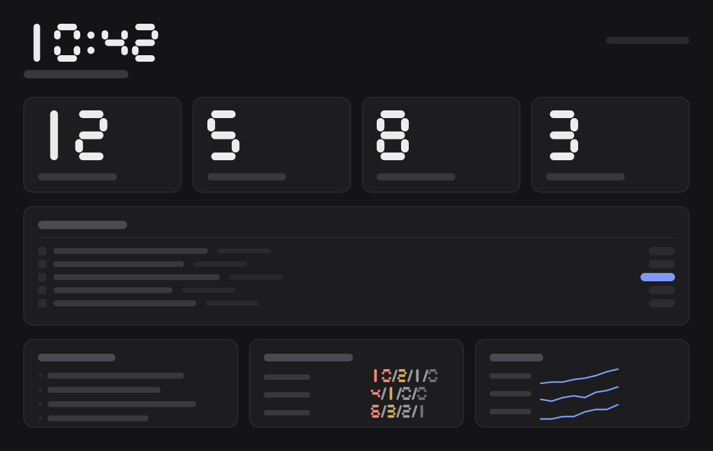

# maintab

A new tab page for GitHub maintainers.



## What it shows

- Your open pull requests, with a badge when comments or reviews have landed since you last looked.
- New comments and reviews across those pull requests since your last visit.
- Your unread GitHub notification threads, each linking straight to the underlying issue, PR, or discussion.
- Open Dependabot alerts across the repos you own, sorted by severity.
- Star counts for a repo list you choose, with a local sparkline of the trend.

## Install

There's no AMO listing yet. Build from source:

```
mise install
pnpm i
pnpm build
```

Then open `about:debugging#/runtime/this-firefox` in Firefox, choose "Load Temporary Add-on", and select any file inside `.output/firefox-mv2`.

For Chrome, build with `pnpm build:chrome` instead. Open `chrome://extensions`, enable Developer mode, choose "Load unpacked", and select the `.output/chrome-mv3` folder.

## Token setup

maintab needs a classic personal access token with the `repo`, `notifications`, and `security_events` scopes. Fine-grained tokens won't work here: GitHub's notifications API doesn't accept them, classic scopes only.

Paste the token into the setup card on first run, or into the settings panel later. It sits in the extension's local storage. It is not encrypted at rest.

## Data handling

Everything runs in the browser. The extension talks to `api.github.com` and nowhere else. There's no backend, no telemetry, and no third-party service in the request path.

The notification list has a hover control on each row that marks the thread read on GitHub and removes it from the list immediately, without waiting for the next poll.

Star history accumulates from the moment you install the extension. GitHub only reports current star counts, not a history, so there's no backfill: a repo's sparkline starts the day you add it to tracking, nothing earlier.

## Contributing

Each card under `cards/` is a module: one file that fetches its data, derives a display slice, and composes the shared kit components for layout. Modules don't carry their own styling. All design tokens, typography, spacing, and card chrome belong to the host kit, and the check step fails a module that imports a stylesheet, sets a `style` attribute, or defines a `<style>` block:

```
pnpm check
```

runs that enforcement alongside the test suite.
